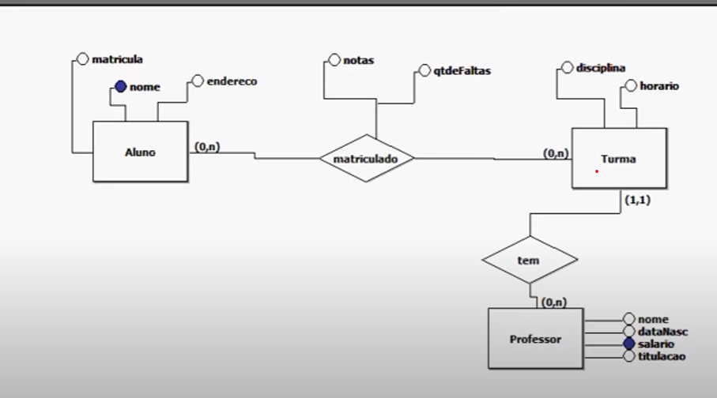

# sb-escola
Projeto está sendo realizado com a linguagem Java e o SGDB MySQL o sem auxílio de frameworks para praticar os seus conceitos fundamentais. 
## Java
Conceitos de lógica de programação em geral: variáveis, if/else/else if, for, forech, while e switch. 
## Programação Orientada a Objetos
Classes, Contrutores, Getters e Setters, Encapsulamento, Modificadores de Acesso (Default, Public, Protected, Private),
Herança, Polimorfismo e Collections.
## MySQL
Criação de tabelas, inserção de chaves estrangeiras, ações CRUD(insert, select, update e delete), criação de queries com join, 
sub-tabelas, triggers, procedures e views.
## Para testar o projeto, realize as seguintes instruções
- No SGDB MySQL, execute o script "data.sql" disponível no caminho: sb-escola/src/main/resources/
- Execute o projeto em uma IDE de sua preferência
- Também é possível compilar a aplicação com auxílio do Maven, por isso, caso seja de sua preferência, execute primeiramente o comando:

                   ./mvn compile

#### Requisitos para testar o projeto

- Possuir a JDK 17
- SGDB MySQL
- Qualquer IDE

## Modelo Entidade Relacionamento

O modelo entidade relacionamento foi inspirado em uma aula do canal "quemsabefaz".  
Disponível em: <https://www.youtube.com/watch?v=RFEBXZ2ddd8>

